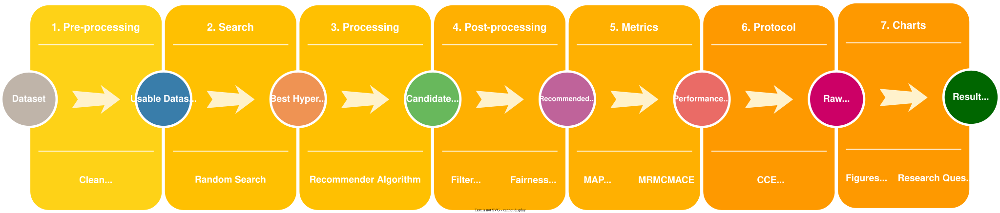

# Pierre-in-Frame

[Pre-Print](https://readthedocs.io/) | [Paper](https://doi.org/xx.xxx/xxxxx.xxxxxx)

 

Pierre-in-Frame is a how-to-create recommendation system focused on multi-objectives.
The framework is a combination of other libraries on recommendation systems and machine learning, such as Scikit-Surprise, Scikit-Pierre and Scikit-learn.
It is constructed to be totally focused on providing a way to produce recommendation systems with more than one objective as calibration, diversity, etc.
In the version 0.1, the framework implements seven collaborative filtering algorithms on the processing and the concept of calibration on the post-processing.
Pierre-in-Frame are composed by **seven steps** in sequence, applying the concept of auto-recsys (auto-ml).
It is totally necessary to run each step following the initial experiment definition because of the concept of auto-recsys.

To create an experiment each step has parameters that receive options from the command line.
Along the steps, the personalization of these parameters can create more than 40 thousand recommendation systems, providing different performance results to the same dataset.
Be cautious with the parameters, if you badly define the configuration a high number of recommender systems will be created, and it is put in a line.

# How-To-Use

## Preparing  
1. Update and upgrade the OS: `sudo apt update && sudo apt upgrade -y && sudo apt install curl`  
2. Download the Anaconda: `curl -O https://repo.anaconda.com/archive/Anaconda3-2023.09-0-Linux-x86_64.sh`   
3. Install the Anaconda: `bash Anaconda3-2023.09-0-Linux-x86_64.sh`  
 
## The code
1. Download the framework: `git clone git@github.com:project-pierre/pierre-in-frame.git`  
2. Go to the framework path: `cd pierre-in-frame/`
3. The framework structure: `ls .`  
3.1. `pierre_in_frame/`: Where all python code is. It is the kernel of the framework code.  
3.2. `data/`: Where all data are saved as raw and clean datasets, candidate items, recommendation lists, execution time, etc.  
3.3. `docs/`: The documentation dir to be used on the readthedocs. **TODO: It is a future work**.  
3.4. `environment/`: It is used to save all framework environment files. The files have the configuration of the run. Each step has a different running variable.  
3.5. `logs/`: It is produced after the first run. The log path is used to save the code status. PS: This directory is created after the first run.  
3.6. `metadata/`: Metadata about the framework.  
3.7. `results/`: The result files will be saved inside this dir, tables, figures, etc.  
3.8. `shell/`: Examples of how-to-run on Linux shell.  

## Conda Environment
1. Load Conda Environment: `conda env create -f environment.yml`    
2. Start the conda env: `conda activate pierre-in-frame`  
3. Install the framework environment: `conda env create -f environment.yml`  
4. Activate the environment: `conda activate pierre-in-frame`  
   4.1. It is also possible to install it through pip requirements  
5. Download, compile, and install the `Project Pierre` libraries
   5.1. Download the Scikit-Pierre, compile, and install it: `https://github.com/project-pierre/scikit_pierre`  
   5.2. Download the Recommender-Pierre, compile, and install it: `https://github.com/project-pierre/recommender-pierre`

## Using the framework
To run the framework it is necessary to go to dir: `cd pierre_in_frame/`. 
Inside this directory are seven python scripts. Each step has a set of parameters that are necessary to run.    

### Step 1: Pre-processing
The pre-processing step is implemented to clean, filter, and model the data.
The framework pre-processes the dataset to provide a structure to be used in all the next steps.
It applies a data partition of your choice. We have implemented four pre-process validation methods.
The pre-processing script provides three functionality to config the experiment:
1. Pre-process based on validation method  
   1.1. Movielens 20M: `python3 step1_preprocessing.py from_file=YES file_name=ml-20m`  
   1.2. Food.com: `python3 step1_preprocessing.py from_file=YES file_name=food`  
   1.3. Last.fm 2B: `python3 step1_preprocessing.py from_file=YES file_name=lfm-2b-subset`  
2. Pre-Compute Distribution. It improves the execution time.  
   2.1. Movielens 20M: `python3 step1_preprocessing.py from_file=YES file_name=ml-20m_distribution`  
   2.2. Food.com: `python3 step1_preprocessing.py from_file=YES file_name=food_distribution`  
   2.3. Last.fm 2B: `python3 step1_preprocessing.py from_file=YES file_name=lfm-2b-subset_distribution`  
3. Pre-Compute One-Hot-Encode. It improves the execution time.  
   3.1. Movielens 20M: `python3 step1_preprocessing.py from_file=YES file_name=ml-20m_ohe`  
   3.2. Food.com: `python3 step1_preprocessing.py from_file=YES file_name=food_ohe`  
   3.3. Last.fm 2B: `python3 step1_preprocessing.py from_file=YES file_name=lfm-2b-subset_ohe`  

You can find the environment files from step 1 in the `environment/step1/` directory.

#### Run Examples
In the directory `shell`, there are examples of scripts to run step 1 for the three datasets cited above.
You can run the command from the main project directory: `sh shell/step1.sh > ./logs/step1.log 2>&1 & disown`.
It will run all step 1 commands shown above.

### Step 2: Best Parameter Search
This step applies the Random Search method to find the best set of hyperparameters.
The best set of parameter values is saved inside the path `data/experiment/hyperparameters/<dataset_name>/`.

#### Run Examples
1. Movielens 20M   
   1.1. CVTT + BPR + ALS: `python3 step2_searches.py from_file=YES file_name=ml-20m`    
   1.2. CVTT + DeepAE: `python3 step2_searches.py from_file=YES file_name=deep_ae_ml-20m`    
2. Food.com Recipes    
   1.1. CVTT + BPR + ALS: `python3 step2_searches.py from_file=YES file_name=food`    
   1.2. CVTT + DeepAE: `python3 step2_searches.py from_file=YES file_name=deep_ae_food`     
3. Last.fm    
   1.1. CVTT + BPR + ALS: `python3 step2_searches.py from_file=YES file_name=lfm-2b-subset`    
   1.2. CVTT + DeepAE: `python3 step2_searches.py from_file=YES file_name=deep_ae_lfm-2b-subset`    

In the directory `shell`, there are examples of scripts to run step 2 for the three datasets cited above.
You can run the command from the main project directory: `sh shell/step2.sh > ./logs/step2.log 2>&1 & disown`.
It will run all step 2 commands shown above.

### Step 3: Processing
The processing step uses the pre-processed data and the hyperparameters to train the chosen recommender algorithm.
The prediction generates a set of candidate items to be used by the post-processing.
All candidate items set are saved inside `data/experiment/{dataset}/candidate_items/{recommender}/trial-{trial}/fold-{fold}/candidate_items.csv`.

#### Run Examples

1. Movielens 20M   
   1.1. BPR + ALS: `python3 step3_processing.py from_file=YES file_name=ml-20m`    
   1.2. DeepAE: `python3 step3_processing.py from_file=YES file_name=deep_ae_ml-20m`    
2. Food.com Recipes    
   1.1. BPR + ALS: `python3 step3_processing.py from_file=YES file_name=food`    
   1.2. DeepAE: `python3 step3_processing.py from_file=YES file_name=deep_ae_food`     
3. Last.fm    
   1.1. BPR + ALS: `python3 step3_processing.py from_file=YES file_name=lfm-2b-subset`    
   1.2. DeepAE: `python3 step3_processing.py from_file=YES file_name=deep_ae_lfm-2b-subset`

In the directory `shell`, there are examples of scripts to run step 3 for the three datasets cited above.
You can run the command from the main project directory: `sh shell/step3.sh > ./logs/step3.log 2>&1 & disown`.
It will run all step 3 commands shown above.

### Step 4: Post-processing
Post-processing is the focus of this framework. We use the Scikit-Pierre to post-process the candidate items given by the recommender algorithms provided by the Scikit-Surprise or other recommender libraries.
The parameters given from the command line are used to create one or more recommendation systems. So, you can change them and create a lot of different systems. Using the same candidate items set as entries to different post-processing formulations is possible.
The recommendations produced by this step are saved in `data/experiment/<dataset_name>/recommendation_lists/`.

#### Run Examples
1. Movielens 20M: `python3 step4_postprocessing.py from_file=YES file_name=ml-20m`    
2. Food.com Recipes: `python3 step4_postprocessing.py from_file=YES file_name=food`     
3. Last.fm: `python3 step4_postprocessing.py from_file=YES file_name=lfm-2b-subset`

In the directory `shell`, there are examples of scripts to run the **step 4** for the three datasets cited above.
You can run the command from the main project directory: `sh shell/step4.sh > ./logs/step4.log 2>&1 & disown`.
It will run all step 4 commands shown above.

### Step 5: Metric
In the Metric step, the recommendation lists produced by the post-processing are evaluated.
In version 0.1, the framework provides five metrics: **TIME**, **MAP**, **MRR**, **MACE** and **MRMC**.
In version 0.2, the framework provides news metrics, such as: **ILS**, **COVERAGE**, **UNEXPECTED**, **SERENDIPITY** and **MAMC**.
Scikit-Pierre provides all metrics. The Scikit-Surprise provides other metrics, so it is possible to call these, too.
The system you want to evaluate is given the same parameters from the post-processing.

#### Run Examples
1. Movielens 20M: `python3 step5_metrics.py from_file=YES file_name=ml-20m`    
2. Food.com Recipes: `python3 step5_metrics.py from_file=YES file_name=food`     
3. Last.fm: `python3 step5_metrics.py from_file=YES file_name=lfm-2b-subset`

In the directory `shell`, there are examples of scripts to run the **step 5** for the three datasets cited above.
You can run the command from the main project directory: `sh shell/step5.sh > ./logs/step5.log 2>&1 & disown`.
It will run all step 5 commands shown above.

### Step 6: Protocol
The protocol step compiles all metrics results, applying an average along the trials and folds.
The final values are the system's performance in each metric.
Coefficients are applied as a new metric. We inherit the coefficients from Scikit-Pierre.
The final file is saved inside: `results/decision/{dataset}/decision.csv`.

#### Run Examples
1. Movielens 20M: `python3 step6_protocol.py from_file=YES file_name=ml-20m`    
2. Food.com Recipes: `python3 step6_protocol.py from_file=YES file_name=food`     
3. Last.fm: `python3 step6_protocol.py from_file=YES file_name=lfm-2b-subset`

In the directory `shell`, there are examples of scripts to run the **step 6** for the three datasets cited above.
You can run the command from the main project directory: `sh shell/step6.sh > ./logs/step6.log 2>&1 & disown`.
It will run all step 6 commands shown above.

### Step 7: Charts
The Chart step uses the compiled raw results from the Protocol step to produce figures, tables, comparisons, and research questions.
It is the last step in the framework. The result files are saved inside: `results/graphics/results/{dataset}/{filename}`.

#### Run Examples
1. Movielens 20M: `python3 step7_charts_tables.py from_file=YES file_name=ml-20m`    
2. Food.com Recipes: `python3 step7_charts_tables.py from_file=YES file_name=food`     
3. Last.fm: `python3 step7_charts_tables.py from_file=YES file_name=lfm-2b-subset`